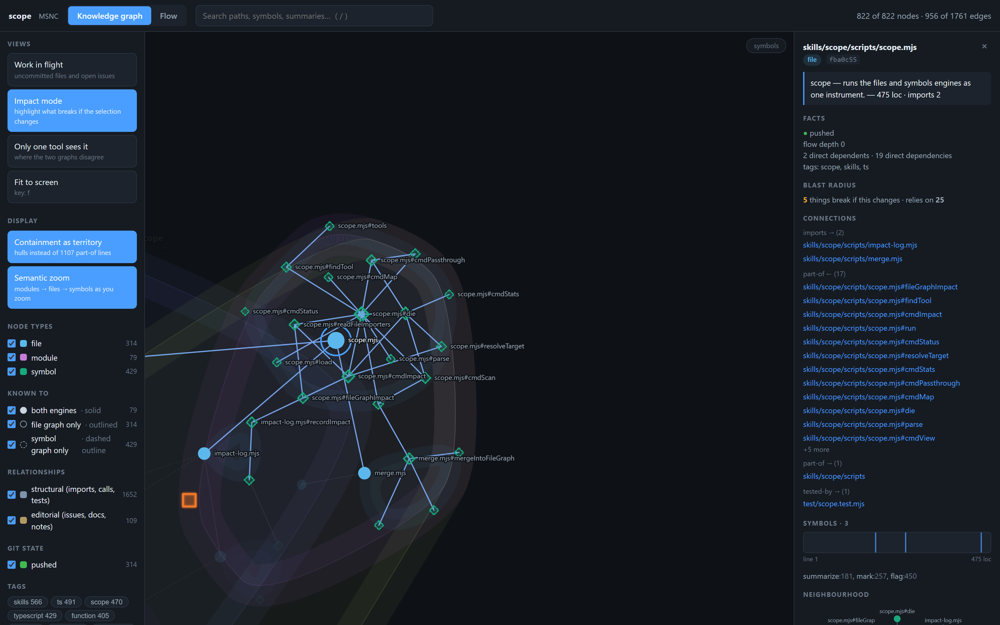
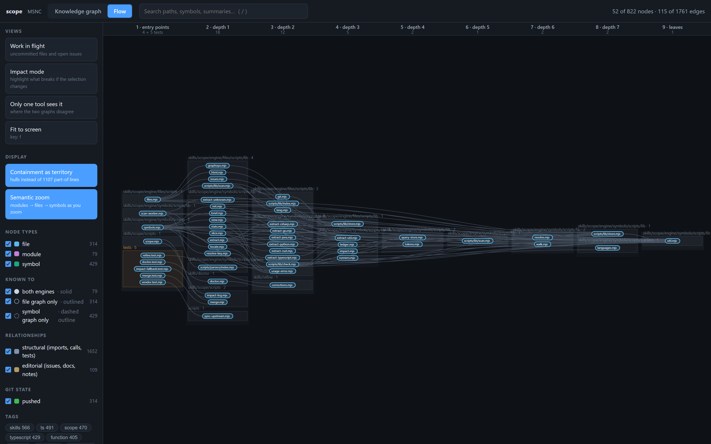
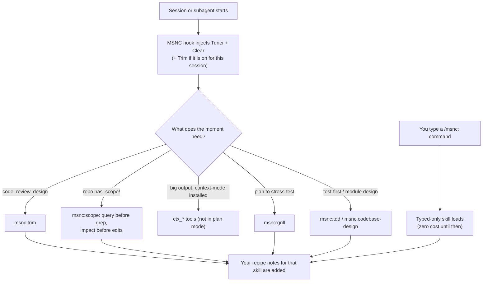
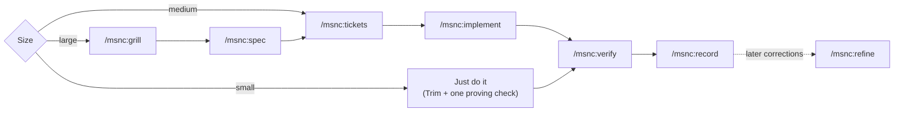

# MSNC: More Signal, No Clutter

A Claude Code plugin for getting more done with less noise. Replies lead with the result. Code changes stay as small as they can. A code map shows what an edit will break before it's made. Nothing counts as done until a check proves it.

Only two short texts load in every session (Clear and Tuner), about 700 tokens in all. Everything else is a skill that loads when the task needs it. MSNC bundles pieces of several community plugins, and each one keeps its license and names its author (see [Built on](#built-on)).

## What it looks like

The same failing test, reported with and without Clear (illustrative):

```text
Without Clear
  Great question! Let me take a look at what's going on here. I ran the test suite and it
  looks like there might be an issue with how discounts are being calculated. There are a
  few possibilities we could explore...

With Clear
  src/cart.test.js:14 fails: expected total 1250, got 1200.
  Cause: applyCoupon applies the discount twice (src/cart.js:31).
  Fix: drop the second call in checkout(); the test passes.
  Try: npm test -- cart
```

`/msnc:doctor` shows what your sessions actually load:

```text
Options: clear on, trim_default off, scope_gate on, pace 3
Always loaded: ~692 tokens (Tuner ~152, Clear ~395, 5 skill descriptions ~145)
Duplicate skills: none
Old Scope layout: none
Recipes unused 30+ days: none
Most-corrected recipes: none
```

## Install

```
/plugin marketplace add Mesanic/msnc
/plugin install msnc@msnc
/msnc:setup
```

`/msnc:setup` walks through the options, the context-mode companion, safe permission rules, the issue tracker and the Scope index. It shows every change and writes only after a yes.

## Modules

| Module | What you get | Loads |
|---|---|---|
| Clear | Replies lead with the result or the action, numbered steps, one next action. Main session and subagents | Always (opt out below) |
| Tuner | A ~200-token list that tells Claude which skill the moment needs. Subagents skip its size line and decisions log and report both to their caller | Always |
| Trim | The smallest change that works | When code work starts; `/msnc:trim full` forces it for the session, subagents included |
| Quiet | Raw tool output stays out of the chat | Only with the context-mode companion installed |
| Relay | Grill, spec, tickets, then one ticket per subagent | When typed; `msnc:grill` and `msnc:tdd` also on demand |
| Scope | A code map and a what-breaks check before every edit | In repos with a Scope index (`.scope/`) |
| Proof | Nothing counts as done until a check proves it | Tuner rule; `/msnc:verify` for the full gate |
| Calibrate | Setup, health check, token audit, cleanup | When typed |
| Record | Turns a task that went well into a recipe; turns later corrections into recipe fixes | When typed |

`/msnc:doctor` shows what your sessions actually load before work starts.

## Commands by phase

| Phase | Command | Does |
|---|---|---|
| Start | `/msnc:setup` | Options, companion, permissions, tracker, Scope index |
| | `/msnc:scope init` | Index the repo. Writes no hooks and no `CLAUDE.md` block |
| Plan | `/msnc:grill` | One decision at a time, each with a recommended answer; "accept all" takes them all |
| | `/msnc:spec` | Conversation → spec in the tracker (local Markdown under `.scratch/` by default) |
| | `/msnc:tickets` | Spec → dependency-ordered tickets, each with a Why line |
| | `/msnc:codebase-design` | Vocabulary for designing deep modules |
| Build | `/msnc:implement` | One fresh `msnc:implementer` subagent per ticket; verified and committed before the next |
| | `/msnc:tdd` | Red → green, one test at a time |
| | `/msnc:trim [lite\|full\|ultra\|off]` | Set Trim for this session; bare `/msnc:trim` reports the level. "stop trim" turns it off |
| Check | `/msnc:verify` | Full pre-PR gate: build, types, lint, tests, security, diff, plus `scope check` with a Scope index |
| | `/msnc:trim-review` | Review a diff for over-engineering |
| | `/msnc:trim-audit` | Same, for the whole repo |
| | `/msnc:trim-debt` | List every `trim:` shortcut comment left for later |
| Learn | `/msnc:record` | Turn what just worked into a recipe |
| | `/msnc:refine` | Propose one recipe fix at a time from recent corrections |
| Anytime | `/msnc:aside` | Answer a side question, then resume |
| | `/msnc:rephrase` | Re-explain the last reply more plainly |
| | `/msnc:handoff` | Write a document a new session can resume from |
| Upkeep | `/msnc:doctor` | Always-loaded cost, duplicate skills, conflicting project settings, old Scope layouts, recipe use |
| | `/msnc:declutter` | Clean stale config: moves items to a trash folder, asks per item |

Agents: `msnc:explorer` (read-only search, safe in plan mode), `msnc:planner` (plans with Trim loaded), `msnc:implementer` (one ticket, test-first, never commits). None pins a model, so your default subagent model and effort apply.

## Scope: what an edit will break

Scope maps the repo twice. The **file graph** holds modules, imports, git state and GitHub issues. The **symbol graph** holds functions, calls, line spans and tests, parsed with tree-sitter for TypeScript and JavaScript, Python, Go, Rust, Java and C#. Each graph has a blind spot. The symbol graph misses a call made through a variable. The file graph sees the import but not the line. `impact` runs both and lists the difference as a cross-check, so a caller that one graph misses still turns up.

`/msnc:scope init` builds the map in `.scope/`. Claude then runs the commands as `node <skill>/scripts/scope.mjs …`; you rarely type them. A real run on this repo:

```text
$ scope impact mergeIntoFileGraph
impact fn:3603fcc07430 mergeIntoFileGraph [up]
def: skills/scope/scripts/merge.mjs:47-429 (function, exact)
direct (2)
  exact fn:a90fada09f17 cmdView skills/scope/scripts/scope.mjs:202-254
  exact mod:6bf94d825518 skills/scope/scripts/merge.test skills/scope/scripts/merge.test.mjs:1-81
tests (1)
  exact skills/scope/scripts/merge.test.mjs
transitive (2, by module)
  skills/scope/scripts/scope (2):
    heuristic cmdScan skills/scope/scripts/scope.mjs:162
    heuristic skills/scope/scripts/scope skills/scope/scripts/scope.mjs:1

cross-check: clean — every importer the file graph sees is accounted for.
```

| Step | Commands | Does |
|---|---|---|
| Orient | `map`, `query "terms"`, `context <path>` | Orientation card, ranked hits for the task's nouns, one card per file (importers, imports, tests, docs, git) |
| Find | `locate <name>`, `slice <id>`, `brief <id>` | Exact file and line span, then only the lines you'll touch |
| Before an edit | `impact <name\|path>` | Dependents, covering tests and the cross-check |
| After an edit | `check`, `scan` | `check` exits 1 if anything dangles; `scan` refreshes both graphs and the viewer |
| Explore | `view`, `neighbors <id>`, `path <a> <b>`, `issues`, `stats` | The viewer, adjacency, how two nodes connect, GitHub issues, counts |
| Keep it tidy | `note`, `verify`, `prune` | Notes that survive moves, drifted summaries, dead nodes |

**The gate.** MSNC's hook refuses an edit to a mapped file until `impact` has run on it in the last 2 hours, and prints the command to run:

```text
Scope: src/users.js is in the code map and no impact check has run.
Run this first, then repeat the edit:
  node ".../skills/scope/scripts/scope.mjs" impact src/users.js
Resolve every entry in its cross-check list before editing: those are the callers symbol analysis cannot see.
```

New files and files outside the map are never gated. The gate covers Edit, Write, MultiEdit, NotebookEdit and file-writing Bash commands (`sed`, `cp`, `mv`, `rm` and similar), but not `>` redirects. Turn it off with the `scope_gate` option.

**The viewer.** `scope view`, and every `scope scan`, writes `.scope/files/view/scope.html`: one self-contained page that makes no network requests. The knowledge graph draws modules as territories and zooms from modules to files to symbols. The Flow view lays the code out from entry points to leaves. Three lenses sit in the sidebar: *Work in flight* (uncommitted files and open issues), *Impact mode* (what breaks if the selection changes) and *Only one tool sees it* (where the two graphs disagree). Press `/` to search and `f` to fit.



*Impact mode on Scope's own CLI, `skills/scope/scripts/scope.mjs`: its symbols and imports, and the side panel's blast radius ("5 things break if this changes").*



*The Flow view of this repo: entry points and tests on the left, leaves on the right.*

## When each skill loads



Model-invoked (only a short description stays loaded): `msnc:trim`, `msnc:grill`, `msnc:tdd`, `msnc:codebase-design`, `msnc:scope`. Every other skill is typed-only.

## Which typed skill in each phase

Before any edit, Tuner states the task's size in one line (the worst of: files, unknowns, irreversible steps, modules crossed; several signals at once → large), so process appears only where it pays for itself.



## Options

Change these in `/config` (the MSNC rows need Claude Code 2.1.269+). The hook reads them as `CLAUDE_PLUGIN_OPTION_<NAME>`.

| Option | Default | What it does |
|---|---|---|
| `clear` | on | Clear reply shape in the main session and in subagents |
| `trim_default` | `off` | Trim level at session start: `off` (loads on demand), `lite`, `full` or `ultra`. A text field; any other value counts as `off` |
| `scope_gate` | on | Refuse edits to files in the Scope index until `scope impact` has run on them |
| `pace` | 3 | `/msnc:implement` offers a stop (with a handoff) after this many tickets; 0 = never. `pace <n>` in its arguments overrides it for one run |

**Opting out of Clear:** set `clear` off in `/config`; it stops in the main session and in subagents. For one session only, send the exact message "normal mode": it drops Clear and Trim until the session ends. There is no undo for Clear in that session; `/msnc:trim <level>` turns Trim back on.

## Record, sizing and decisions

- **Recipes.** `/msnc:record` drafts a typed-only skill from the current session: why, when to use it, steps and a done-check. It saves to `.claude/skills/<name>/` (shared through git) or, on request, `~/.claude/skills/<name>/`, and writes nothing before a yes. `/msnc:refine` reads recent corrections, failed checks and rejected approaches and proposes one fix at a time, as a diff.
- **Recipe notes.** Put notes for any skill, MSNC's included, in `.claude/msnc/notes/<skill>.md` (project) or `~/.claude/msnc/notes/<skill>.md` (personal). A namespaced skill like `msnc:implement` maps to `notes/msnc/implement.md`. The hook adds them whenever that skill loads; where they differ from the skill, the notes win.
- **Just-enough sizing.** Small: just do it. Medium: tickets, then implement. Large: grill, spec, tickets, then implement. The planner agent sizes the same way.
- **Decide to Decide.** Reversible name and file picks are made without asking, appended to `docs/decisions.md` as `date · named X in Y · why · undo`, and that line is quoted in the reply. `/msnc:grill` logs each answer it settles the same way. Irreversible or destructive choices get one question with a recommended answer.
- **A why in every delegation.** Tickets carry a Why line tied to a user story; every implementer brief and commit message carries the why; Trim asks the why behind every new file, dependency or abstraction.
- **Pacing.** `/msnc:implement` offers a stopping point every `pace` tickets. Failures are reported as cause, fix and the recipe change that prevents a repeat, never as blame.

## Quiet: the context-mode companion

[context-mode](https://github.com/mksglu/context-mode) keeps raw tool output in a sandbox so only the answer reaches the chat. MSNC doesn't bundle or depend on it: it's ELv2 and about 140 MB with native parts. Install it separately if you want Quiet:

```
/plugin marketplace add mksglu/context-mode
/plugin install context-mode@context-mode
```

Tuner routes to its `ctx_*` tools only when they exist, and never in plan mode (Read, Grep and Glob avoid approval prompts there). When context-mode is enabled in your settings, MSNC has Claude load the `ctx_*` tools with ToolSearch before its first filtering step, so work waits for a server that's still connecting instead of falling back to Bash and Read. `/msnc:setup` offers `ask` rules for its two destructive tools, `ctx_purge` and `ctx_upgrade`.

## Windows notes

- Every hook is one Node script (`hooks/msnc.mjs`); no bash needed. It exits early when nothing applies (60–85 ms cold on the author's Windows machine).
- `hooks/hooks.json` uses exec form (`"command": "node"` plus `args`), so plugin paths with spaces need no shell quoting.
- `.gitattributes` checks text files out with LF line endings on every OS; the copy checks compare bytes.
- The Scope engine (about 11 MB, mostly WebAssembly grammars) uses Node built-ins only, no native binaries.

## Status

v0.1.2. Unit tests: `npm test`; syntax check: `npm run check`. All 16 behavior evals in `evals/` have run: 12 on native Windows, and the 4 that need a shell under WSL2. After the fix reruns of 2026-09-23 and 2026-09-24, every case passed its latest run. `indexed-repo-runs-impact-before-edit` is flaky: twice it scored 2/3 on the first run and 3/3 on the rerun. [evals/RESULTS.md](evals/RESULTS.md) has each failure and fix. The Scope gate's Bash filter is confirmed for `sed` but not yet probed for `cp` or `rm`, and options saved in `/config` haven't been checked in a live session.

## Built on

MSNC copies from these projects. Each copied folder keeps the upstream `LICENSE` and an `UPSTREAM.md` (repo, pinned commit, local changes); [THIRD_PARTY_NOTICES.md](THIRD_PARTY_NOTICES.md) carries every license text and `vendor.json` the pins.

| Project | Author | License | Used for |
|---|---|---|---|
| [ponytail](https://github.com/DietrichGebert/ponytail) | Dietrich Gebert | MIT | Trim, `msnc:trim-review`, `msnc:trim-audit`, `msnc:trim-debt`; Clear's code-output rule |
| [i-have-adhd](https://github.com/ayghri/i-have-adhd) | Ayoub Ghriss (ayghri) | MIT | Clear |
| [skills](https://github.com/mattpocock/skills) | Matt Pocock | MIT | grill, spec, tickets, tdd, codebase-design, rephrase, handoff, setup |
| [ECC](https://github.com/affaan-m/ECC) | Affaan Mustafa (affaan-m) | MIT | verify, doctor, declutter, aside; the sizing idea (orch-pipeline) |
| [context-mode](https://github.com/mksglu/context-mode) | mksglu | ELv2 | Quiet, as an optional companion. Not bundled |

Scope began as a standalone repo, now an archived snapshot at [Mesanic/msnc-scope](https://github.com/Mesanic/msnc-scope).

Record, recipe notes, just-enough sizing, Decide to Decide, the why rule and pacing follow principles inspired by [ProcessDriven](https://processdriven.co) by Layla Pomper. ProcessDriven® is a registered trademark. MSNC is not affiliated with or endorsed by ProcessDriven or Layla Pomper, and copies none of its templates or course material.

## License

MIT. See [LICENSE](LICENSE). Copied parts keep their own licenses, listed above.
