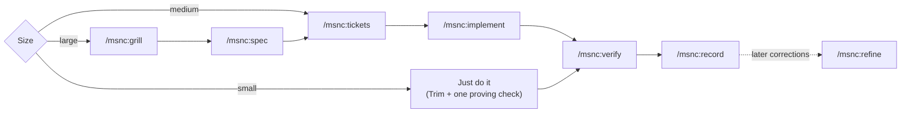

# MSNC: More Signal, No Clutter

One Claude Code plugin that bundles a blend of community add-ons: minimal code, lean context, focused replies, safe edits, one ticket at a time.

Only two short texts load in every session (Clear and Tuner). Everything else is a skill that loads when the task needs it. Every borrowed piece keeps its license and names its author (see [Built on](#built-on)).

## Install

```
/plugin marketplace add Mesanic/msnc
/plugin install msnc@msnc
/msnc:setup
```

`/msnc:setup` walks through the options, the context-mode companion, safe permission rules, the issue tracker and the Scope index. It shows every change and writes only after a yes.

## Modules

| Module | What you get | Loads |
|---|---|---|
| Clear | Replies lead with the result or the action, numbered steps, one next action. Main session and subagents | Always (opt out below) |
| Tuner | A ~200-token list that tells Claude which skill the moment needs. Subagents skip its size line and decisions log and report both to their caller | Always |
| Trim | The smallest change that works | When code work starts; `/msnc:trim full` forces it for the session, subagents included |
| Quiet | Raw tool output stays out of the chat | Only with the context-mode companion installed |
| Relay | Grill, spec, tickets, then one ticket per subagent | When typed; `msnc:grill` and `msnc:tdd` also on demand |
| Scope | A code map and a what-breaks check before every edit | In repos with a Scope index (`.atlas/`) |
| Proof | Nothing counts as done until a check proves it | Tuner rule; `/msnc:verify` for the full gate |
| Calibrate | Setup, health check, token audit, cleanup | When typed |
| Record | Turns a task that went well into a recipe; turns later corrections into recipe fixes | When typed |

`/msnc:doctor` shows what your sessions actually load before work starts.

## Commands by phase

| Phase | Command | Does |
|---|---|---|
| Start | `/msnc:setup` | Options, companion, permissions, tracker, Scope index |
| | `/msnc:scope init` | Index the repo. Writes no hooks and no `CLAUDE.md` block |
| Plan | `/msnc:grill` | One decision at a time, each with a recommended answer; "accept all" takes them all |
| | `/msnc:spec` | Conversation → spec in the tracker (local Markdown under `.scratch/` by default) |
| | `/msnc:tickets` | Spec → dependency-ordered tickets, each with a Why line |
| | `/msnc:codebase-design` | Vocabulary for designing deep modules |
| Build | `/msnc:implement` | One fresh `msnc:implementer` subagent per ticket; verified and committed before the next |
| | `/msnc:tdd` | Red → green, one test at a time |
| | `/msnc:trim [lite\|full\|ultra\|off]` | Set Trim for this session; bare `/msnc:trim` reports the level. "stop trim" turns it off |
| Check | `/msnc:verify` | Full pre-PR gate: build, types, lint, tests, security, diff, plus `sextant check` with a Scope index |
| | `/msnc:trim-review` | Review a diff for over-engineering |
| | `/msnc:trim-audit` | Same, for the whole repo |
| | `/msnc:trim-debt` | List every `trim:` shortcut comment left for later |
| Learn | `/msnc:record` | Turn what just worked into a recipe |
| | `/msnc:refine` | Propose one recipe fix at a time from recent corrections |
| Anytime | `/msnc:aside` | Answer a side question, then resume |
| | `/msnc:rephrase` | Re-explain the last reply more plainly |
| | `/msnc:handoff` | Write a document a new session can resume from |
| Upkeep | `/msnc:doctor` | Always-loaded cost, duplicate skills, conflicting project settings, old Scope layouts, recipe use |
| | `/msnc:declutter` | Clean stale config: moves items to a trash folder, asks per item |

Agents: `msnc:explorer` (read-only search, safe in plan mode), `msnc:planner` (plans with Trim loaded), `msnc:implementer` (one ticket, test-first, never commits). None pins a model, so your default subagent model and effort apply.

## When each skill loads


Model-invoked (only a short description stays loaded): `msnc:trim`, `msnc:grill`, `msnc:tdd`, `msnc:codebase-design`, `msnc:scope`. Every other skill is typed-only.

## Which typed skill in each phase

Before any edit, Tuner states the task's size in one line (the worst of: files, unknowns, irreversible steps, modules crossed; several signals at once → large), so process appears only where it pays for itself.



## Options

Change these in `/config` (the MSNC rows need Claude Code 2.1.269+). The hook reads them as `CLAUDE_PLUGIN_OPTION_<NAME>`.

| Option | Default | What it does |
|---|---|---|
| `clear` | on | Clear reply shape in the main session and in subagents |
| `trim_default` | `off` | Trim level at session start: `off` (loads on demand), `lite`, `full` or `ultra`. A text field; any other value counts as `off` |
| `scope_gate` | on | Refuse edits to files in the Scope index until `sextant impact` has run on them |
| `pace` | 3 | `/msnc:implement` offers a stop (with a handoff) after this many tickets; 0 = never. `pace <n>` in its arguments overrides it for one run |

**Opting out of Clear:** set `clear` off in `/config`; it stops in the main session and in subagents. For one session only, send the exact message "normal mode": it drops Clear and Trim until the session ends. There is no undo for Clear in that session; `/msnc:trim <level>` turns Trim back on.

## Record, sizing and decisions

- **Recipes.** `/msnc:record` drafts a typed-only skill from the current session: why, when to use it, steps and a done-check. It saves to `.claude/skills/<name>/` (shared through git) or, on request, `~/.claude/skills/<name>/`, and writes nothing before a yes. `/msnc:refine` reads recent corrections, failed checks and rejected approaches and proposes one fix at a time, as a diff.
- **Recipe notes.** Put notes for any skill, MSNC's included, in `.claude/msnc/notes/<skill>.md` (project) or `~/.claude/msnc/notes/<skill>.md` (personal). A namespaced skill like `msnc:implement` maps to `notes/msnc/implement.md`. The hook adds them whenever that skill loads; where they differ from the skill, the notes win.
- **Just-enough sizing.** Small: just do it. Medium: tickets, then implement. Large: grill, spec, tickets, then implement. The planner agent sizes the same way.
- **Decide to Decide.** Reversible name and file picks are made without asking, appended to `docs/decisions.md` as `date · named X in Y · why · undo`, and that line is quoted in the reply. `/msnc:grill` logs each answer it settles the same way. Irreversible or destructive choices get one question with a recommended answer.
- **A why in every delegation.** Tickets carry a Why line tied to a user story; every implementer brief and commit message carries the why; Trim asks the why behind every new file, dependency or abstraction.
- **Pacing.** `/msnc:implement` offers a stopping point every `pace` tickets. Failures are reported as cause, fix and the recipe change that prevents a repeat, never as blame.

## Quiet: the context-mode companion

[context-mode](https://github.com/mksglu/context-mode) keeps raw tool output in a sandbox so only the answer reaches the chat. MSNC doesn't bundle or depend on it: it's ELv2 and about 140 MB with native parts. Install it separately if you want Quiet:

```
/plugin marketplace add mksglu/context-mode
/plugin install context-mode@context-mode
```

Tuner routes to its `ctx_*` tools only when they exist, and never in plan mode (Read, Grep and Glob avoid approval prompts there). `/msnc:setup` offers `ask` rules for its two destructive tools, `ctx_purge` and `ctx_upgrade`.

## Windows notes

- Every hook is one Node script (`hooks/msnc.mjs`); no bash needed. It exits early when nothing applies (60–85 ms cold on the author's Windows machine).
- `hooks/hooks.json` uses exec form (`"command": "node"` plus `args`), so plugin paths with spaces need no shell quoting.
- `.gitattributes` checks text files out with LF line endings on every OS; the copy checks compare bytes.
- The Scope engine (about 11 MB, mostly WebAssembly grammars) uses Node built-ins only, no native binaries.
- Scope's edit gate catches file-writing Bash commands (`sed`, `cp`, `mv`, `rm` and similar) but not `>` redirects; a miss lets the edit through.

## Status

v0.1.0. Unit tests: `npm test`; syntax check: `npm run check`. Behavior evals live in `evals/` and have not been run yet. Not yet verified in a live session: the `/config` rows, and Claude Code honoring the hook `if` filters.

## Built on

MSNC copies from these projects. Each copied folder keeps the upstream `LICENSE` and an `UPSTREAM.md` (repo, pinned commit, local changes); [THIRD_PARTY_NOTICES.md](THIRD_PARTY_NOTICES.md) carries every license text and `vendor.json` the pins.

| Project | Author | License | Used for |
|---|---|---|---|
| [ponytail](https://github.com/DietrichGebert/ponytail) | Dietrich Gebert | MIT | Trim, `msnc:trim-review`, `msnc:trim-audit`, `msnc:trim-debt`; Clear's code-output rule |
| [i-have-adhd](https://github.com/ayghri/i-have-adhd) | Ayoub Ghriss (ayghri) | MIT | Clear |
| [skills](https://github.com/mattpocock/skills) | Matt Pocock | MIT | grill, spec, tickets, tdd, codebase-design, rephrase, handoff, setup |
| [ECC](https://github.com/affaan-m/ECC) | Affaan Mustafa (affaan-m) | MIT | verify, doctor, declutter, aside; the sizing idea (orch-pipeline) |
| [sextant](https://github.com/Mesanic/sextant) | Mesanic | MIT | Scope (engine and edit gate); bundles web-tree-sitter and seven grammars, notices in `skills/scope/THIRD-PARTY-NOTICES.md` |
| [context-mode](https://github.com/mksglu/context-mode) | mksglu | ELv2 | Quiet, as an optional companion. Not bundled |

Record, recipe notes, just-enough sizing, Decide to Decide, the why rule and pacing follow principles inspired by [ProcessDriven](https://processdriven.co) by Layla Pomper. ProcessDriven® is a registered trademark. MSNC is not affiliated with or endorsed by ProcessDriven or Layla Pomper, and copies none of its templates or course material.

## License

MIT. See [LICENSE](LICENSE). Copied parts keep their own licenses, listed above.
